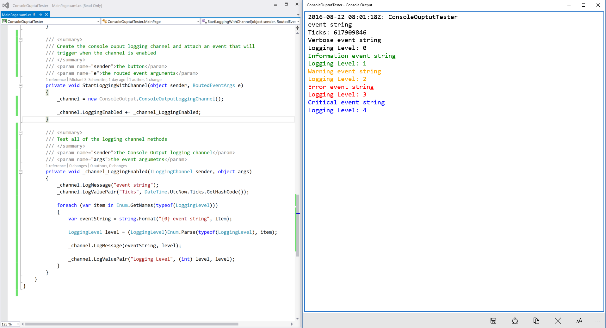

# ConsoleOutputTester
A tester for [Console Output](https://www.microsoft.com/store/apps/9NBLGGH515N5) Universal Windows Platform app

## consoleoutput: Protocol
Launch app with consoleoutput: protocol handler using Windows.System.Launcher class.

consoleoutput:?title=My app name&input=true&message=Hello World
- title: the title that will be put into console windows
- input: true or false; if true then an output field will be shown and the 
          calling applications AppServiceConnection will receive events through 
          the AppServiceConnection.RequestRecieved event.
- message: a line of text that you want to output in Console Output

## Console Output App Service
Once the app has been launched, open a connection to the app with the Windows.ApplicationModel.AppService.AppServiceConnection class.
- AppServiceName: "consoleoutput"
- PackageFamilyName: "49752MichaelS.Scherotter.ConsoleOutput_9eg5g21zq32qm"

## Logging Messages
Once the connection has been opened, use AppServiceConnection.SendMessageAsync() to send messages

"Message":      (string) the message to output

"LoggingLevel": (string) the logging level which will translate to a color
- Verbose:		Black
- Error:			Red
- Warning:		Orange
- Critical:		Blue
- Informational:	Green

Any other message parameters will be shown as "Key: Value"

## ConsoleOutput.ConsoleOutputLoggingChannel
This is a class you can use in your app using the standard logging facility in in UWP apps to open a channel to Console output
Full source code is [here](https://github.com/mscherotter/ConsoleOutputTester/blob/master/ConsoleOuptutTester/ConsoleOutput/ConsoleOutputLoggingChannel.cs).
To see an sample that uses the Windows Logging APIs, look [here](https://github.com/Microsoft/Windows-universal-samples/tree/master/Samples/Logging).

### Code Sample for using ConsoleOutputLoggingChannel from [MainPage.xaml.cs](https://github.com/mscherotter/ConsoleOutputTester/blob/master/ConsoleOuptutTester/ConsoleOuptutTester/MainPage.xaml.cs)
	/// 

	/// Create the console ouput logging channel and attach an event that will
	/// trigger when the channel is enabled
	/// 

	/// <param name="sender">the button</param>
	/// <param name="e">the routed event arguments</param>
	private void StartLoggingWithChannel(object sender, RoutedEventArgs e)
	{
		_channel = new ConsoleOutput.ConsoleOutputLoggingChannel();

		_channel.LoggingEnabled += _channel_LoggingEnabled;
	}

	/// 

	/// Test all of the logging channel methods
	/// 

	/// <param name="sender">the Console Output logging channel</param>
	/// <param name="args">the event argumetns</param>
	private void _channel_LoggingEnabled(ILoggingChannel sender, object args)
	{
		sender.LogMessage("event string");
		sender.LogValuePair("Ticks", DateTime.UtcNow.Ticks.GetHashCode());

		foreach (var item in Enum.GetNames(typeof(LoggingLevel)))
		{
			var eventString = string.Format("{0} event string", item);

			LoggingLevel level = (LoggingLevel)Enum.Parse(typeof(LoggingLevel), item);

			sender.LogMessage(eventString, level);

			sender.LogValuePair("Logging Level", (int) level, level);
		}
	}

